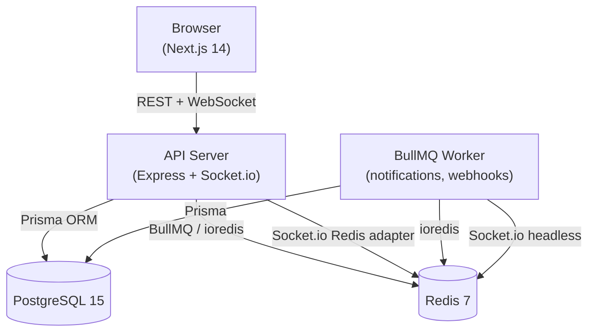

# FlowBoard

**Real-time collaborative project management — built from scratch to learn the full stack.**

[](https://github.com/your-username/flowboard/actions/workflows/ci.yml)


FlowBoard is a Jira/Linear-inspired project management tool with kanban boards, real-time presence, drag-and-drop task ordering, and GitHub OAuth. The primary goal of this project is **learning** — every layer is implemented deliberately rather than hidden behind a framework.

---

## Features

- **Kanban boards** — drag-and-drop tasks between status columns with optimistic UI updates
- **Real-time collaboration** — live presence indicators, instant task/comment sync via Socket.io
- **GitHub OAuth** — hand-written OAuth 2.0 flow with CSRF state protection (no Passport.js)
- **Background jobs** — BullMQ workers for notifications, webhook delivery, and scheduled cleanup
- **Swagger UI** — auto-generated API docs at `/api/docs`
- **Rate limiting** — sliding-window rate limiter built on Redis sorted sets
- **Role-based access** — workspace roles: Owner, Admin, Member, Viewer

---

## Tech Stack

| Layer | Choice | Why |
|---|---|---|
| **API server** | Express 4 + TypeScript | Minimal framework — every middleware is explicit and learnable |
| **Frontend** | Next.js 14 (App Router) | File-based routing, RSC, excellent DX |
| **Database** | PostgreSQL 15 via Prisma 7 | Relational data with type-safe queries; Prisma v7 requires driver adapter |
| **Cache / queues** | Redis 7 + BullMQ | Sorted-set rate limiter, OAuth CSRF state, Socket.io adapter, job queues |
| **Real-time** | Socket.io 4 | Rooms, presence, cross-process emit via Redis adapter |
| **State (client)** | TanStack Query v5 + Zustand v5 | Server state vs. UI state clearly separated |
| **Auth** | JWT (access + refresh) + GitHub OAuth | Manual implementation — no Auth.js/Passport |
| **Drag-and-drop** | @dnd-kit | Accessible, headless, works with React 18 |
| **Validation** | Zod (server + client) | Shared schemas; parse, don't validate |
| **Build** | pnpm workspaces | Single lockfile, efficient hoisting |
| **Infra** | Docker + GitHub Actions | Multi-stage images, CI with real Postgres + Redis |

---

## Architecture Overview



See [ARCHITECTURE.md](./ARCHITECTURE.md) for a detailed breakdown of each subsystem.

---

## Project Structure

```
flowboard/
├── packages/
│   ├── server/                  # Express API + Socket.io
│   │   ├── prisma/              # Schema, migrations, seed
│   │   ├── src/
│   │   │   ├── lib/             # Shared utilities (prisma, redis, jwt, queue…)
│   │   │   ├── middleware/      # Auth, rate-limit, validation, error handler
│   │   │   ├── routes/          # Route handlers (auth, workspaces, tasks…)
│   │   │   ├── services/        # Business logic layer
│   │   │   └── workers/         # BullMQ worker processes
│   │   └── Dockerfile
│   ├── web/                     # Next.js 14 App Router
│   │   ├── src/
│   │   │   ├── app/             # Pages ((auth), (app) route groups)
│   │   │   ├── components/      # UI components + layout
│   │   │   ├── hooks/           # TanStack Query hooks
│   │   │   ├── lib/             # api-client, auth, socket
│   │   │   ├── providers/       # QueryProvider, SocketProvider
│   │   │   └── stores/          # Zustand stores
│   │   └── Dockerfile
│   └── shared/                  # Shared TypeScript types + Zod schemas
│       └── src/
│           ├── socket/          # Socket.io event type definitions
│           ├── schemas/         # Shared Zod schemas
│           └── types/           # Shared interfaces
├── docker-compose.yml           # Production stack
├── docker-compose.dev.yml       # Dev: infra only (DB + Redis)
└── .github/workflows/ci.yml     # CI: lint → type-check → test → docker build
```

---

## Local Development

### Prerequisites

- Node.js 20+
- pnpm 10+ (`npm i -g pnpm`)
- Docker (for Postgres + Redis)

### 1. Start infrastructure

```bash
# Spin up Postgres + Redis only (server/web run on host for hot reload)
docker compose -f docker-compose.yml -f docker-compose.dev.yml up -d postgres redis
```

### 2. Install dependencies

```bash
pnpm install
```

### 3. Configure environment

```bash
cp packages/server/.env.example packages/server/.env
# Edit packages/server/.env — see Environment Variables below
```

### 4. Run migrations

```bash
cd packages/server
pnpm exec prisma migrate dev
pnpm exec prisma db seed   # optional: seeds demo data
```

### 5. Start all services

```bash
# From the root — starts API server, BullMQ worker, and Next.js dev server
pnpm dev
```

| Service | URL |
|---|---|
| Web (Next.js) | http://localhost:3000 |
| API server | http://localhost:4007 |
| Swagger UI | http://localhost:4007/api/docs |

---

## Environment Variables

### `packages/server/.env`

| Variable | Required | Description |
|---|---|---|
| `DATABASE_URL` | ✅ | PostgreSQL connection string |
| `REDIS_URL` | ✅ | Redis connection string |
| `JWT_ACCESS_SECRET` | ✅ | Secret for signing access tokens (min 32 chars in prod) |
| `JWT_REFRESH_SECRET` | ✅ | Secret for signing refresh tokens (different from access) |
| `GITHUB_CLIENT_ID` | OAuth | From github.com/settings/developers |
| `GITHUB_CLIENT_SECRET` | OAuth | From github.com/settings/developers |
| `GITHUB_CALLBACK_URL` | OAuth | Must match GitHub App settings (e.g. `http://localhost:4007/api/auth/github/callback`) |
| `FRONTEND_URL` | OAuth | Where to redirect after OAuth (`http://localhost:3000`) |
| `CORS_ORIGIN` | | Allowed CORS origin (defaults to `http://localhost:3000`) |
| `PORT` | | API server port (default: `4007`) |

### `packages/web/.env.local`

| Variable | Required | Description |
|---|---|---|
| `NEXT_PUBLIC_API_URL` | | Backend API base URL (default: `http://localhost:4007`) |

### GitHub OAuth Setup

1. Go to **github.com/settings/developers → OAuth Apps → New OAuth App**
2. Set **Homepage URL**: `http://localhost:3000`
3. Set **Authorization callback URL**: `http://localhost:4007/api/auth/github/callback`
4. Copy **Client ID** and **Client Secret** into `packages/server/.env`

---

## Running with Docker (production)

```bash
# Build and start all services
docker compose up --build

# Or with custom secrets:
JWT_ACCESS_SECRET=your-secret JWT_REFRESH_SECRET=your-other-secret docker compose up --build
```

Services will be available at:
- **Web**: http://localhost:3000
- **API**: http://localhost:4007

---

## API Documentation

Swagger UI is served at **http://localhost:4007/api/docs** when the server is running.

The OpenAPI spec (JSON) is available at **http://localhost:4007/api/docs.json**.

---

## Running Tests

```bash
# Requires Postgres + Redis running (see step 1 above)
cd packages/server
pnpm test
```

Tests use real Postgres and Redis (no mocks) to catch integration-level bugs. Each test suite gets isolated data via unique random IDs.
